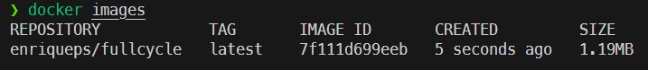
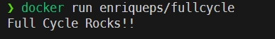

# Full Cycle Challenge: Optimizing a golang image

## Project Description

Create a docker image with a golang message display, that is less than 2 mbs and publish to git hub and docker hub.

## Docker Hub link

- https://hub.docker.com/r/enriqueps/fullcycle

## Dockerfile.prod

- Stage 1

```
# Starting a golang:alpine base image
FROM golang:alpine AS builder

# Selecting working directory
WORKDIR /usr/src/go_app

# Copying the app
COPY . .

# Compiling the Binary and Removing Debug Info
RUN go build -ldflags '-s -w' full-cycle.go
```

- Stage 2
```
# Starting with Scratch base image
FROM scratch

# Selecting working directory
WORKDIR /app

# Copying binary
COPY --from=builder /usr/src/go_app /app

# running 
CMD [ "./full-cycle" ]
```

## Inserting some parameters

- Parameters for the linker that will help to decrease the size of the final executable  ( -ldflags '-s -w' )

```
The -s parameter removes debug information from the executable and the -w prevents DWARF generation. 

DWARF (Debugging With Attributed Record Formats).
```

## Build 

```
docker build -t enriqueps/fullcycle . -f Dockerfile.prod
```

## Images
```
docker images
```


## Run

```
docker run enriqueps/fullcycle
```


## References
- https://gobyexample.com/hello-world
- https://hub.docker.com/_/golang/
- https://hub.docker.com/_/scratch/
- https://pkg.go.dev/cmd/link